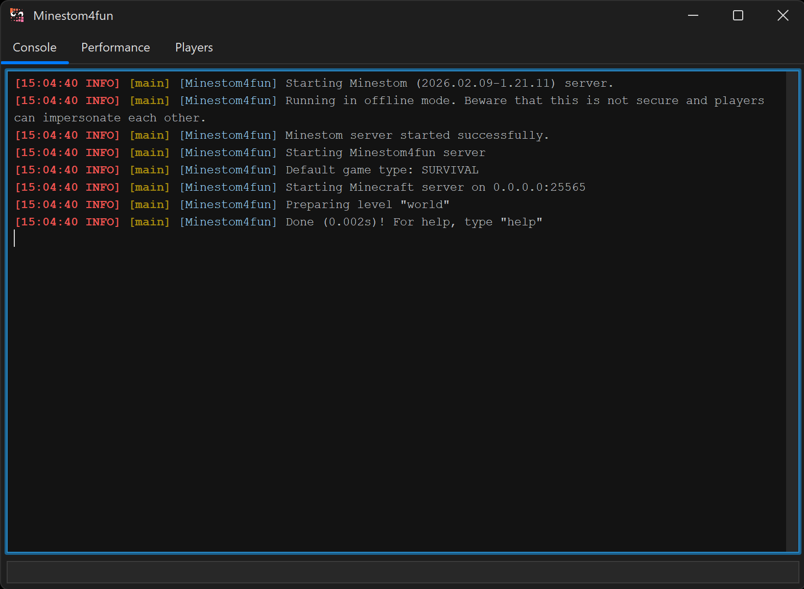

# Minestom-Dashboard

A lightweight server dashboard for Minestom, built with Java Swing.


*Example: [Minestom4fun](https://github.com/Kanelucky/Minestom4fun) using this library as its server dashboard*

## Features

- **Console tab** — Live server output with ANSI color support, command input
- **Performance tab** — Real-time RAM and TPS graphs
- **Players tab** — Online player list with UUID

## Installation

Add JitPack to your `settings.gradle.kts`:
```kotlin
dependencyResolutionManagement {
    repositories {
        mavenCentral()
        maven { url = uri("https://jitpack.io") }
    }
}
```

Add the dependency to your `build.gradle.kts`:
```kotlin
dependencies {
    implementation("com.github.Kanelucky:Minestom-Dashboard:v0.1.1")
}
```

## Usage

### Kotlin
```kotlin
// Before starting the server
val dashboard = Dashboard.getInstance(
    DashboardConfig(
        title = "My Server",
        playerCountPrefix = "Online: ",
        playerColumns = arrayOf("Name", "UUID")
    )
)

// After server has started
dashboard.afterServerStarted()
```

### Java
```java
// Before starting the server
Dashboard dashboard = Dashboard.getInstance(
    new DashboardConfig("My Server", "Online: ", new String[]{"Name", "UUID"})
);

// After server has started
dashboard.afterServerStarted();
```

### Default config
```kotlin
// Uses default config (title: "Minestom Dashboard")
val dashboard = Dashboard.getInstance()
dashboard.afterServerStarted()
```

## Configuration

| Field | Default | Description |
|---|---|---|
| `title` | `"Minestom Dashboard"` | Window title |
| `playerCountPrefix` | `"Online: "` | Prefix for player count label |
| `playerColumns` | `["Name", "UUID"]` | Column headers for player table |

## Credits

This library is based on and heavily inspired by the following open-source projects:

### [](https://github.com/AllayMC/Allay) [AllayMC/Allay](https://github.com/AllayMC/Allay)
- `Dashboard.kt` — ported from `org.allaymc.server.gui.Dashboard` (originally by daoge_cmd)
- `ConsolePanel.kt` — ported from `org.allaymc.server.gui.ConsolePanel` (originally by GeyserMC, adapted by daoge_cmd)
- `GraphPanel.kt` — ported from `org.allaymc.server.gui.GraphPanel` (originally by GeyserMC, adapted by daoge_cmd)
- `ANSIColor.kt` — ported from `org.allaymc.server.gui.ANSIColor` (originally by GeyserMC, adapted by daoge_cmd)

Licensed under the **GNU Lesser General Public License v3.0 (LGPL-3.0)**.  
Copyright (c) AllayMC Contributors

### [](https://github.com/GeyserMC/Geyser) [GeyserMC/Geyser](https://github.com/GeyserMC/Geyser)
- Original author of `ConsolePanel`, `GraphPanel`, and `ANSIColor` logic

Licensed under the **MIT License**.  
Copyright (c) 2019-2022 GeyserMC

---

Modifications made from original:
- Converted from Java to Kotlin
- Replaced AllayMC APIs with Minestom APIs
- Removed plugin tab
- Added TPS graph alongside RAM graph
- Added `DashboardConfig` for customization